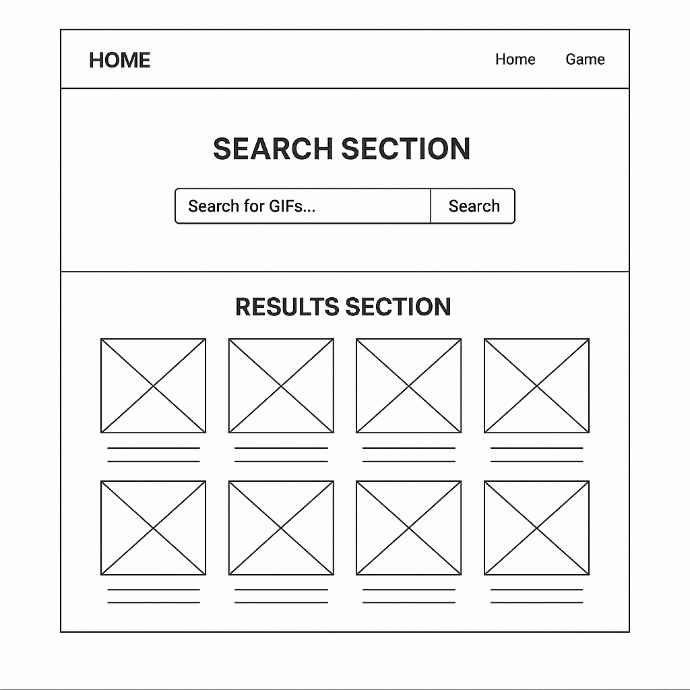
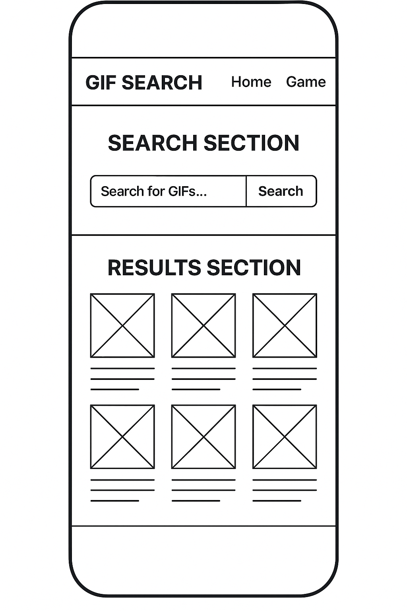
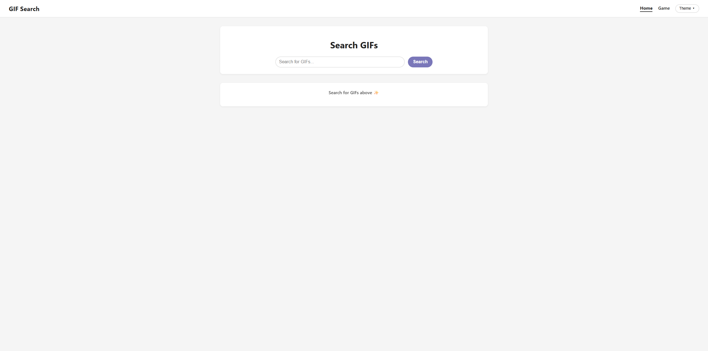
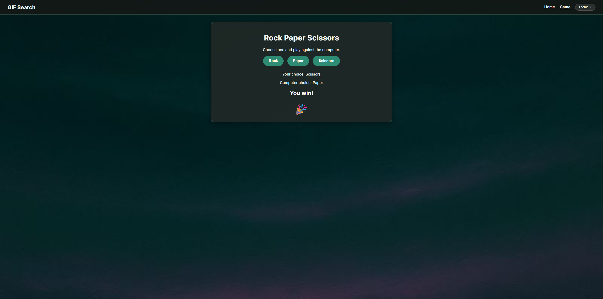
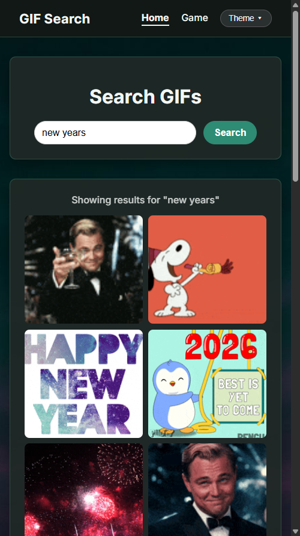

# Project 2 – GIF Search Website

## Author
**Misty Mitchell**  
GitHub: https://github.com/MistyMirandaM

---

## Overview
This project is a responsive website that allows users to search for GIFs using the Giphy API. Users can enter a keyword, submit a search request, and view the returned GIFs displayed in a responsive grid layout. The project also includes a bonus Rock Paper Scissors game page to demonstrate additional JavaScript functionality and user interaction.

The site supports multiple visual themes (Default, Pastel, and Dark), which are saved using localStorage to persist user preferences between sessions.

---

## Wireframes

### Desktop View

### Mobile View

---

## Website Screenshots

### Home Page

### Search Results

### Game Page

### Mobile Page

---

## Features / Functionality
- Search for GIFs using the Giphy Search API
- Displays GIF results dynamically from API responses
- Responsive grid layout that works on desktop and mobile devices
- Theme switcher (Default, Pastel, Dark) with saved preferences
- Navigation menu with multiple links
- Bonus Rock Paper Scissors game with animations and sound effects
- Clean, modern UI using custom CSS and Google Fonts

---

## How to Use
1. Open the website using the GitHub Pages link.
2. Enter a keyword into the search bar on the Home page.
3. Click **Search** to load GIFs related to your keyword.
4. Use the **Theme** menu in the navigation bar to change the site’s appearance.
5. Navigate to the **Game** page to play Rock Paper Scissors against the computer.

---

## Technologies Used
- HTML5
- CSS3
- JavaScript (ES6)
- Giphy API
- Google Fonts
- GitHub Pages for hosting

---

## Future Improvements
- Add pagination or infinite scrolling for GIF results
- Allow users to favorite or download GIFs
- Add more mini-games or interactive features
- Improve accessibility (ARIA labels, keyboard navigation)
- Add search filters such as rating or GIF size

---

## Live Demo
GitHub Repository:  
https://github.com/MistyMirandaM/Project2

GitHub Pages Site:  
(https://mistymirandam.github.io/Project2/)

---

## Notes
This project was built as part of a Software Engineering Bootcamp to demonstrate working with APIs, responsive layouts, JavaScript logic, and GitHub workflows.

